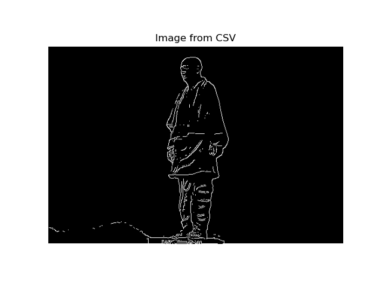
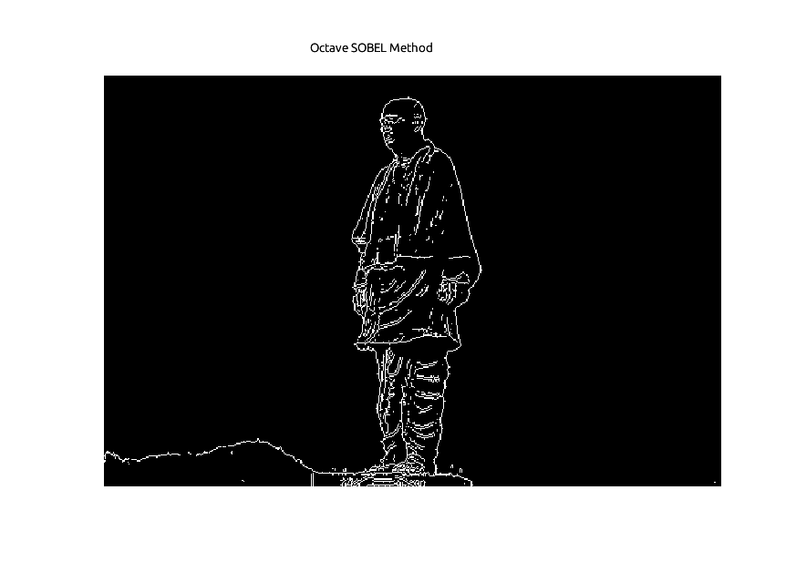

# Edge Detection Tool (`edge.sci`)

This mathematical tool discovers boundaries or "edges" of objects inside an image using different computational methods.

## The Main Function (`edge`)

The `edge` function is your primary way to detect edges. You simply pass it an image and select your method.

**Calling Sequence:**
```scilab
[BW, THRESH] = edge(IM)                  // Uses Sobel method by default
[BW, THRESH] = edge(IM, METHOD)          // METHOD = "sobel", "prewitt", or "roberts"
[BW, THRESH] = edge(IM, METHOD, thresh)  // Pick a custom threshold
```

---

## Results (Sobel Default Method)

Here is a visual comparison of the edge detection output using the default Sobel method:

| Scilab Implementation | Octave Implementation |
| :---: | :---: |
|  |  |

## 1. Sobel Method (`edge_sobel`)

This method calculates image gradients by running a custom mathematical convolution filter over the image. It highlights both vertical and horizontal edges equally.

**Mathematics (Kernel Formulations):**

$$G_x = \begin{bmatrix} -1 & 0 & 1 \\ -2 & 0 & 2 \\ -1 & 0 & 1 \end{bmatrix}, \quad G_y = \begin{bmatrix} -1 & -2 & -1 \\ 0 & 0 & 0 \\ 1 & 2 & 1 \end{bmatrix}$$

**Magnitude ($M$):**
$$M = \sqrt{I_x^2 + I_y^2}$$

*(Where $I_x$ and $I_y$ are the result of multiplying the image with $G_x$ and $G_y$ respectively)*

---

## 2. Prewitt Method (`edge_prewitt`)

Very similar to the Sobel method, but the Prewitt kernel doesn't emphasize the center pixels as strongly. It applies a uniform average across the rows/columns.

**Mathematics (Kernel Formulations):**

$$G_x = \begin{bmatrix} -1 & 0 & 1 \\ -1 & 0 & 1 \\ -1 & 0 & 1 \end{bmatrix}, \quad G_y = \begin{bmatrix} -1 & -1 & -1 \\ 0 & 0 & 0 \\ 1 & 1 & 1 \end{bmatrix}$$

**Magnitude ($M$):**
$$M = \sqrt{I_x^2 + I_y^2}$$

---

## 3. Roberts Method (`edge_roberts`)

This uses a smaller $2 \times 2$ diagonal kernel. It's faster and highlights diagonal cross-edges best!

**Mathematics (Kernel Formulations):**

$$G_x = \begin{bmatrix} 1 & 0 \\ 0 & -1 \end{bmatrix}, \quad G_y = \begin{bmatrix} 0 & 1 \\ -1 & 0 \end{bmatrix}$$

**Magnitude ($M$):**
$$M = \sqrt{I_x^2 + I_y^2}$$

---

## Edge Thinning (`non_max_suppression`)

When the above mathematical methods calculate $M$, the resulting edges are often thick and blurry. By applying "Non-Maximum Suppression," this function thins the edges down to crisp, `1-pixel` wide distinct boundaries.

**Mathematics:**

1. **Calculate Angle:** Determine the edge direction using the separate gradient components:  
   $$\theta = \arctan\left(\frac{I_y}{I_x}\right)$$
2. **Local Comparison:** Look at the pixels strictly across the $\theta$ direction trajectory.
3. **Suppress:** If the target center magnitude ($M$) is strictly smaller than the adjacent pixels along the line of the gradient, its geometric value is dropped to $0$.

---

## Testing

A complete test suite is available in `test_edge.sce`. It includes:

* **`edge()`**: Verifies default Sobel parameters, explicit Prewitt/Roberts usage, and custom thresholds.
* **`non_max_suppression()`**: Tests boundary thinning on vertical, horizontal, flat, uniform, and diagonal arrays.
* **`conv2_custom()`**: Validates spatial convolutions against identity filtering, impulse responses, and blurring.
* **`edge_sobel()`**: Checks automatic magnitude discovery against standard images, empty backgrounds, and extreme thresholds.
* **`edge_prewitt()`**: Verifies limit calculation metrics natively, flat fields, and scale checks.
* **`edge_roberts()`**: Demonstrates precise diagonal isolated mapping limits and randomized data bounds logic execution.

---
